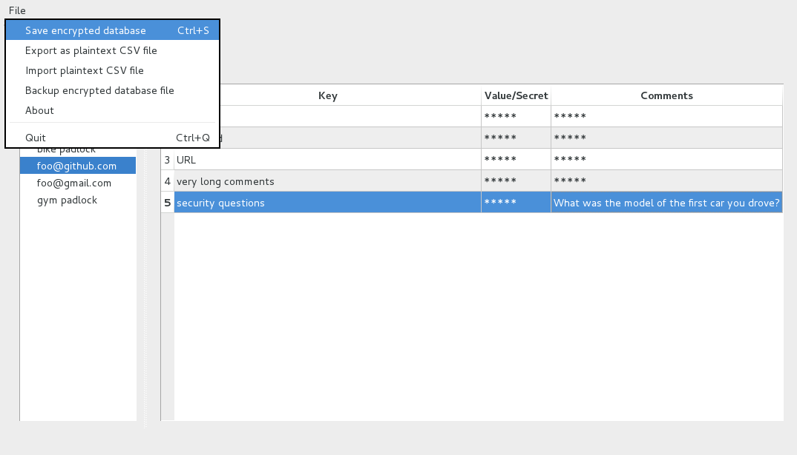

# TrezorPass: a hardware-backed password manager


TrezorPass is a PyQt-based password manager that uses the [Trezor](http://www.trezor.io/)
hardware token to do encryption of passwords. It is similar to KeepassX or
kwalletmanager in function. It can store passwords, logons, URLs, PINs, comments, etc.

The Password database is stored in encrypted form in a single file on your computer.
No access to the internet is required for its use. It allows an unlimited
count of password entries to be stored and enables the possibility of recovery
if your original Trezor is misplaced (mnemonic and passphrase are required to recover).

Below  a sample screenshot. More screenshots [here](screenshots).



# Security features

  * **secure**: even in the worst case with a virus on your computer, that has access to your
    keyboard, your applications and your memory, only the passwords
    you are copying-and-pasting can be stolen. All unused passwords
    remain safely secured by Trezor
  * works offline, no cloud service required
  * portable, stores all information in a single file
  * symmetric password encryption key never leaves the Trezor
  * button confirmation on Trezor is required to activate decryption of a password
  * upon requesting password decryption, user sees on Trezor's display decryption
    of which password group is requested before confirmation
  * export of passwords to a CSV file is possible, also requires explicit button confirmation
  * import of passwords from a CSV file is possible, allowing migration from other password
    managers.
  * a specific migration program is available for easy migrate from [KeePass](http://keepass.info/)
    to TrezorPass
  * a backup function for backing up the encrypted password database is provided for convenience
  * 10 seconds after copying a password to the clipboard the clipboard is automatically cleared again
  * if Trezor is lost, recovery from seed on a new Trezor and using the same
    password will also recover encrypted password database (in theory recovery
    can be done without Trezor, but such script is not yet written)

# Runtime requirements

* Use of passphrases must have been already enabled on your [Trezor](https://www.trezor.io) device.
* [Trezor](https://www.trezor.io) device
* [Python](https://www.python.org/) v2.7 or 3.4+
* [PyCrypto](https://pypi.python.org/pypi/pycrypto)
* [PyQt5](https://pypi.python.org/pypi/PyQt5)
* [Qt5](https://doc.qt.io/qt-5/)
* [trezorlib from python-trezor](https://github.com/trezor/python-trezor)
* [Versions 0.5.0 and older used PyQy4 instead of PyQy5. Read the README.md
file of v0.5.0 for build requirements, dependencies, etc. Basically anything
relating to PyQt5 has to be replaced with the corresponding component in PyQt4.
`pyuic5` becomes `pyuic4`. `pyqt5-dev-tools` becomes `pyqt4-dev-tools`
and so forth.]

# Building

Even though the whole code is in Python, there are few Qt5 `.ui` form files that
need to be transformed into Python files. There is `Makefile`, you just need to run

    make

## Build requirements

* PyQt5 development tools are necessary, namely `pyuic5` (look for a package named
`pyqt5-dev-tools`, `PyQt5-devel` or similar). Required to run `make`.
* Depending on one's set-up one might need: `qttools5-dev-tools`
(also sets up some of the Qt5 environment variables)
* Depending on one's set-up one might need: `python-pyqt5` (Qt5 bindings for Python 2)
* Depending on one's set-up one might need: `python3-pyqt5` (Qt5 bindings for Python 3)
* Depending on one's set-up one might need: `python-pyqt5.qtsvg` (to display SVG logos in Python 2)
* Depending on one's set-up one might need: `python3-pyqt5.qtsvg` (to display SVG logos in Python 3)

# Running

Run:

    python TrezorPass.py
or

    python3 TrezorPass.py

On rare occasions one of the command line arguments might become useful:

```
TrezorPass.py [-v] [-h] [-l <level>] [-p <passphrase>] [[-d] -f <pwdbfile>]
    -v, --version
            print the version number
    -h, --help
            print short help text
    -l, --logging
            set logging level, integer from 1 to 5, 1=full logging, 5=no logging
    -p, --passphrase
            master passphrase used for Trezor.
            It is recommended that you do not use this command line option
            but rather give the passphrase through a small window interaction.
    -f, --pwdbfile
            name of an existing password file to use instead of the default one;
            must be a valid TrezorPass password file
    -d, --setdefault
            set the file provided with `-f` as default, i.e. this will
            be the password file opened from now on

    All arguments are optional. Usually none needs to be used.
```

# How export to CSV works

Each password is encrypted and stored twice. Once with symmetric AES-CBC function
of Trezor that always requires button confirmation on device to decrypt. Second
encryption is done to public RSA key, whose private counterpart is encrypted
with Trezor. Export requires private RSA to be decrypted and then used to decrypt
the passwords. The RSA key is managed internally, so that you do not need to
worry about it.

# Alternative products/projects

If you are looking for something simpler, something without a GUI,
something that uses only a CLI, have a look at `pass` from
[passwordstore.org](https://www.passwordstore.org/). You can use `pass`
together with a Trezor-based GPG identity and key.
See also [gpg on Trezor](https://github.com/romanz/trezor-agent/).

# FAQ - Frequently Asked Questions

**Question:** Can I help or contribute?

**Answer:**

Yes, you can. It would help a lot if you assist in getting the word out.
If you like the tool or like the idea please spread the word on Twitter, Reddit,
Facebook, etc. It will be appreciated. Furthermore, you can blog about it,
give feedback, review the code, contribute to the code, etc.
- - -
**Question:** I read something about an RSA key somewhere? Do I need to
create it? Can I use my own? Where is it? How many bits is it?

**Answer:**

* No, you do not need to create it, it is created automatically for you.
* No, you cannot use your own existing RSA key.
* It is created and stored Trezor-encrypted in the pwdb database password file.
* It is a 4096-bit RSA keypair.
- - -
**Question:** What crypto technology is used?

**Answer:** Various.

* 256-bit AES
* 4096-bit RSA
* [Trezor](https://www.trezor.io)
- - -
**Question:** Is there a config file or a settings file?

**Answer:** No, there are no config and no settings files. The only vlue stored outside of the pwdb password database file is its filename (full path).
This string is stored in the QQtCore.QSettings.
- - -
**Question:** Does TrezorPass require online connectivity, Internet access?

**Answer:** No.
- - -
**Question:** Does TrezorPass require a Google, DropBox or similar cloud service provider account?

**Answer:** No.
- - -
**Question:** How many files are there?

**Answer:** For the data there is always just one file, the pwdb password database file. For the TrezorPass executable it depends. At best there is only a single executable. This single-file-executable is provided for you for Linux 64-bit. On other platforms you can create it yourself with [pyinstaller](www.pyinstaller.org) and [pyinstaller](https://github.com/pyinstaller/pyinstaller/wiki). So, with 2 files (one executable and one datafile) you can do everything.
- - -
**Question:** In which language is TrezorPass written?

**Answer:** [Python](https://www.python.org/). It run on Python 2.7 and 3.4+.
- - -
**Question:** Do I need to have a [Trezor](https://www.trezor.io/) in order to use TrezorPass?

**Answer:** Yes, a Trezor is required.
- - -
**Question:** How big is the single-file-executable for Linux?

**Answer:** Currently around 23M.
- - -
**Question:** How many passwords can I store in TrezorPass?

**Answer:** For practical purposes, unlimited. Let's just say "thousands".
- - -
**Question:** Is there a limit on the password size or comment size?

**Answer:** Currently, the password length is limited to 512 characters and the password+comments to 4096 characters. You can increment these limits in the software if you really need larger values.
- - -
**Question:** Can I see the source code?

**Answer:** Yes, this is an open source software project. You can find and download all source code from [Github](https://github.com/hiviah/TrezorPass) or any of its forks.
- - -
**Question:** Does the TrezorPass contain ads?

**Answer:** No.
- - -
**Question:** Does the TrezorPass cost money?

**Answer:** No. It is free, libre, and open source.
- - -
**Question:** Does TrezorPass call home? Send any information anywhere?

**Answer:** No. Never. You can also use it on an air-gapped computer if you want to. It does not use any network calls at any time. It does not update itself automatically.
- - -
**Question:** Does TrezorPass have a backdoor?

**Answer:** No. Read the source code to convince yourself.
- - -
**Question:** How can I know that TrezorPass does not contain a virus?

**Answer:** Download the source from [Github](https://github.com/) and inspect the source code for viruses. Don't download it from unreliable sources.
- - -
**Question:** How can someone steal **all** my passwords?

**Answer:** In order to get access to all your passwords one would need to a) steal your physical Trezor device, and b) steal your TrezorPass password database file, and) know or steal your Trezor passphrase for TrezorPass (=TrezorPass master passphrase) and d) know or steal your Trezor PIN code. Alternatively, one would need to a) steal your 24 Trezor seed words, and b) steal your TrezorPass password database file, and) know or steal your Trezor passphrase for TrezorPass (=TrezorPass master passphrase).
- - -
**Question:** Can a **remote** hacker or a virus on my computer steal **all** my passwords?

**Answer:** A remote hacker cannot have access to your physical Trezor device. A remote hacker should not have access to your 24 Trezor seed words (as those should never be stored online). Under these conditions a remote hacker **cannot** steal **all** your passwords at once.
- - -
**Question:** Can a keyboard logger steal a password?

**Answer:** Not if you are careful. Passwords can be created with a "Generate random password" button click without the use of a keyboard. Using an existing password is usually done with copy-and-paste, ie. ^C and ^V. So, again, you can use a password without using the keyboard. The keyboard logger only sees that you have used ^C and ^V.
- - -
**Question:** Can a screen grabber or a person looking over my shoulder steal a password?

**Answer:** Not if you are careful. Passwords can be created with a "Generate random password" button click without the use of a keyboard. Passwords are printed as `*` on the screen. If you use it via copy-and-paste and paste it to, say, a safe web login or a login screen, there as well the password is printed as `*`. So, no information about the password is normally visible on the screen. However, if you paste it to, say, a plaintext text editor, then you and anyone else watching can see it on your screen.
- - -
**Question:** What can be stolen? How can it be stolen?

**Answer:** A virus or malware on your computer can steal **individual** passwords, but never **all** of them. Say you have an email account with company X. There you have a username, a password, a security question, and a recovery email address. Say, you have stores all 4 items in TrezorPass. Say, you have some 99 other passwords from other accounts. Now you connect with your computer to company X's website to read your email. You copy and paste your user name and your password from TrezorPass to the webpage to enter your mail account. When you copy your username you have to give permissions on trezor by clicking the confirmation button on the Trezor. The same when you copy the password to the clipboard. Now at this moment the username and password are in the memory of your computer. Now assume you have a virus that reads your computers memory. It can now copy your username and password and send it off to his server. Later the hacker can enter into your mail account and read your email. (This is why you should have [2FA](https://en.wikipedia.org/wiki/2FA) or [FIDO/U2F](https://en.wikipedia.org/wiki/U2F) protection on your accounts). Note that the hacker could neither steal your security question nor your recovery email address. So, in our example the hacker most likely could not change your email password (as he does not have the security question answer). And of course, the hacker could not steal any of the other 99 passwords from the other accounts. So, in short, at best a hacker can steal the items that you unlock with your Trezor and only for a short time while they are in memory. The only way to protect yourself from this is by using 2FA and/or FIDO/U2F where there are 2 factors and the hacker can only steal one preventing the hacker from entering into your accounts even when he is in possession of one factor.
- - -
**Question:** Is TrezorPass available in my language?

**Answer:** It is only available in English.
- - -
**Question:** Is TrezorPass portable?

**Answer:** Yes. You can have all information on 2 files: the TrezorPass application and the password database file. Copy the 2 files (executable and data) onto a USB stick or SD card and carry them with you together with your Trezor. (Maybe in the future the files might be stored on the `Trezor 2` on-device storage? Pure speculation but Who knows?)
- - -
**Question:** Can I use TrezorPass on multiple computers? Can I sync it on multiple devices/computers?

**Answer:** Yes. There are many ways to do with various degrees of convenience.

* One solution might be to carry the password database always with you on an SD card or USB stick.
* Another simple way is just to copy the software and the password database to 2 or more computers/devices. That is static and the password database is not synchronized.
* Imagine you have a home network or a small office network. You might place the password database file to a shared disk, a shared server, a shared NAS or similar. Thereby all computers/devices on this local network have access to the same password database. All computers are in sync because there is only a single shared copy of the password database. In this scenario TrezorPass should be used by only one person at a time. Since you usually have only one Trezor that is usually no problem.
* You can sync the password database yourself between various computers/devices on one or multiple networks. On Linux you might use rsync or a multitude of other solutions.
* You can sync the password database with known cloud service providers. E.g. you can use DropBox to sync the password database between all your devices. DropBox cannot read your database as it is encrypted. You can also give the password database some unassuming name like "photo.jpg" if you do not want to draw attention.
- - -
**Question:** Can I contribute to the project?

**Answer:** Yes. It is open source. Go to [Github](https://github.com/hiviah/TrezorPass).
- - -
**Question:** Can I migrate from another password manager such as [KeePass](http://keepass.info/) or [Pass](https://www.passwordstore.org/) or others to TrezorPass?

**Answer:** Yes. But it is not a one-click or two-click affair.

* Step 1: export your passwords from the original password manager to a plaintext CSV or plain text file. You might want to do this on a secure or air-gapped computer or with a [LiveDvd OS](https://en.wikipedia.org/wiki/Live_DVD) if you have one available.
* Step 2: Modify the CSV file manually or via script so that it follows the required TrezorPass CSV import standard. The required TrezorPass CSV import standard is very simple: 4-element-tuplets separated by comma (`,`) and when needed quoted (`"`), with the
letters slash (`\`) and quote (`"`) escaped with a slash (such as `\\` and `\"`). The 4-element tuplets are: group name, key, password, and comments.
* Step 3: import this CSV file into TrezorPass. All entries found in the CSV file will be added to the existing database.
* Examples of a valid CSV file format for import: Some sample lines

```
First Bank account,login,myloginname,
foo@gmail.com,2-factor-authentication key,abcdef12345678,seed to regenerate 2FA codes
foo@gmail.com,recovery phrase,"passwd with 2 commas , ,",
foo@gmail.com,large multi-line comments,,"first line, some comma,
second line
multi-lines are OK"
phone,PIN,1234,my phone PIN
phone,PIN2,1234,"comment with a slash \\ and  quote \" and more ..."
```

More details [here](https://github.com/8go/TrezorPass/pull/6).
- - -
**Question:** How do I migrate from KeePass2 to TrezorPass?

**Answer:** Specifically for [Keepass version 2](http://keepass.info/) a migration program was written than allows easy migration to TrezorPass. You can find it in the same directory as `TrezorPass`. It is called `convertKeePass2XmlToTrezorPassCsv.py`. To see how it works run this command
```
python convertKeePass2XmlToTrezorPassCsv.py -h
```
It will print the following help message:
```
convertKeePass2XmlToTrezorPassCsv.py [-v] [-h] [-i <keepass2.xml>] [-o <trezorpass.csv>]
    -v, --version
            print the version number
    -h, --help
            print help text
    -i, --input
            name of XML file generated from KeePass2 export
    -o, --output
            name of CSV file generated by this program which can then be imported into TrezorPass

    All arguments are optional.

    By default it expects the input file to be named "keepass2.xml".

    By default it creates the output file named "trezorpass.csv". If it
    already exists it will be overwritten.

    The purpose of this program is to migrate a KeePass2 database to TrezorPass.
    This is done in a 3-Step process.

    Step 1: Open KeePass2, using the `File | Export` function in the menu, export
    your .kdb file to an XML file of type `KeePass XML (2.x)`. Name the output file
    `keepass2.xml`. KeePass2 also allows partial exports, like only exporting
    your entries in the group `eMail`.

    Step 2: Run this program `convertKeePass2XmlToTrezorPassCsv`. It will convert
    the `keepass2.xml` file into a CSV file named `trezorpass.csv`. Be careful,
    if that file exists, it will be overwritten. Optionally, if desired, you
    can make manual changes to the `trezorpass.csv` file.

    Step 3: Open TrezorPass and use the `Import plaintext CSV file`
    function from the menu to import the `trezorpass.csv` file. All information
    from the `trezorpass.csv` file will be added to any existing information
    in the TrezorPass password database. Optionally, if desired, create an
    empty TrezorPass password database first.

    Examples:
    # normal operation, expects file `keepass2.xml` to exist
    convertKeePass2XmlToTrezorPassCsv.py

    # operation with non-standard filenames
    convertKeePass2XmlToTrezorPassCsv.py -i keepassEmail.xml -o trezorpassEmail.csv
```

- - -
**Question:** Am I locked into TrezorPass? Can I migrate from TrezorPass to another password manager such as KeePass or [Pass](https://www.passwordstore.org/) or others?

**Answer:** No, you are not locked in. Yes, you can migrate from TrezorPass to other password managers. But it is not a one-click or two-click affair.

* Step 1: export your passwords from TrezorPass to a plaintext CSV file.
* Step 2: modify this CSV file according to the requirements of your other password manager
* Step 3: import the modified CSV file into your other password manager
* You might want to do all these 3 steps on a secure or air-gapped computer or with a [LiveDvd OS](https://en.wikipedia.org/wiki/Live_DVD) if you have one available.
- - -
**Question:** What if I lose my password database file?

**Answer:** Then you lost all your passwords. The passwords are **not** stored on the Trezor. The passwords are only stored in the password database file. So keep it safe. (`Trezor 2` does not exist yet, but it might come with on-device storage in the future. In this future case you might store a copy of the password database file on the device. But even then you should keep a copy somewhere else as well.)
- - -
**Question:** Should I backup my password database file?

**Answer:** Yes you should. For convenience there is a backup function built-into TrezorPass. Use if frequently. For your safety keep a second (or third) copy on a different device/computer/SD-card/USB-stick.
- - -
**Question:** What if I lose my Trezor and my 24 Trezor seed words or my TrezorPass master password?

**Answer:** Then you will not be able to open your TrezorPass. For practical purposes you have lost all your passwords. Brute-forcing is not a viable work-around.
- - -
**Question:** On which platforms, operating systems is TrezorPass available?

**Answer:** On all platforms, operating systems where [Python](https://www.python.org/) 2.7 or 3.4+ and [PyQt](https://en.wikipedia.org/wiki/PyQt) v5 is available: Windows, Linux, Unix, Mac OS X. Internet searches show Python and PyQt solutions for Android and iOS, but it has not been investigated, built or tested on Android or iOS. It was only tested on Linux.
- - -
**Question:** Can I run on Qt4?

**Answer:** Yes, there is an old version (v3.0) that supports Qt4. Newer versions do not support PyQt4 but require PyQt5.
- - -
**Question:** Can I migrate from Python 2 to Python 3?

**Answer:** Yes, TrezorPass runs on both. So, you easily move your environment from Python 2 to Python 3.
- - -
**Question:** Can I migrate from Python 3 back to Python 2?

**Answer:** TrezorPass runs on both but the implementation of `pickle` is different on both versions.
The TrezorPass passwordd database file uses `pickle`. When you move from Python 3 back to Python 2 and
then want to run TrezorPass, you will get the error message `Critical: Could not decrypt passwords: unsupported pickle protocol: 4`and the program aborts. The workaround is to export your database to a CSV file in Python 3, then start with
an empty database file in Python 2 and import the CSV file. Then you are ready to go.
- - -
**Question:** Are there any warranties or guarantees?

**Answer:** No, there are no warranties or guarantees whatsoever.
- - -
**Question:** More questions?

**Answer:** Let us know.
- - -

# To-do List

- [ ] Add a `Show All` right-click item in the password list to show all passwords and all comments with one click.
- [ ] Add command line arguments to the CLI such as `--add group key password comment`,
        `--show group key`, `--showcomments group key` or `--delete group [key]` and using `xsel` even `--paste group key`.
- [ ] Spread the information about the availability of this tool on social
networks like Reddit, Twitter or Facebook. Any help appreciated.


</> on :octocat: with :heart:
